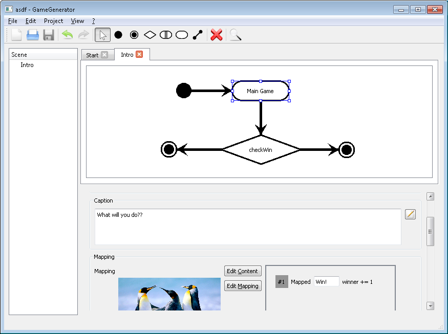
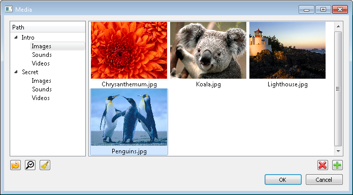

# GameGenerator
GameGenerator is a Qt5 based visual editor for creating narrative adventure games, most commonly published as HTML games.
It provides a flow-chart like interface, where single pages are linked to build the game's story line(s).
The pages display graphical content and offer links to navigate through the game.

You can find the latest version in the [/bin](https://github.com/kingnak/GameGenerator/tree/master/bin/) directory on its github project.

## Basics
Games are composed of single pages, which are connected through links. A page ususally displays some content (e.g. an image) and provides
means to navigate to following pages. This can be decisions links at the bottom of the page, clickable areas in the displayed content,
or a prominent action button.

When following a link, game variables might be modified. By this, previous decisions taken by the player can affect the course of the game.

### Pages
Pages are the main building blocks of a game. They deliver the game's story and interaction to the player.

There are different types of pages:
* *Start Page* There must be exactly 1 start page per project. This is where the game starts
* *End Page* There can be any number of end pages. This is where the game ends
* *Action Page* Displays content and provides a single action to navigate to the next page
* *Decision Page* Displays content and provides any number of decision links to navigate to other pages
* *Condition Page* Evaluates a condition based on game variables and automatically forwards to another page, based on the outcome

Action and Decision pages can have clickable areas on the content to provide additional navigation possiblities.

### Links
Links are the navigation edges between the pages. They usually provide some text, and can modify variables to keep track of decisions
made by the player. These can then be evaluated by Condition Pages, to provide alternative game workflows.

### Scenes
In the GameGenerator editor, pages are grouped into scenes. This facilitates the management of more or less independet parts of the
game. There can be any number of scenes (you can create a game with only 1 scene). There is no real impact on the final game by
scenes.  
It is possible to link pages across scenes.

### Media assets
GameGenerator has a media manager that allows the creator to manage all the assets used by a GamGenerator project. Like pages,
media assets are grouped into the defined scenes.

The media manager copies all files into a central repository, so that a GameGenerator project is a self-contained folder, suitable
for redistributing, or versioning systems like git.

### Generators
Generators will create a playable game from a GG Project. Currently, there is only an HTML generator, that creates a series of HTML
pages playable in a web browser.

# Editing projects
TODO

## Variables

## Styles
TODO

## Shortcuts
### With selected page
* **F2** Edit name (select whole text)
* **F3** Open caption editor
* **F4** Open content editor
* **F5** Open mapping editor

### When assigning media
* **Double click on media** Assign and close media manager

### When editing caption
* **Ctrl+Enter** Accept and close

